# FluxSwap - Cross-Chain FX Swaps with CCTP v2 & Uniswap v4

🏆 **Hackathon Project for Circle (Benefactor Sponsor)**

FluxSwap is a revolutionary DeFi protocol enabling real-time foreign exchange swaps between USDC and EURC across multiple blockchains using Circle's Cross-Chain Transfer Protocol v2 (CCTP v2) and Uniswap v4 hooks.

## 📋 Project Overview

### Problem Statement
Traditional cross-border FX transactions suffer from:
- High fees and slow settlement times (2-5 business days)
- Limited liquidity across different blockchain networks
- Complex multi-step processes requiring multiple platforms
- Lack of real-time settlement for international payments

### Solution
FluxSwap leverages:
- **CCTP v2 Fast Transfer**: Sub-second cross-chain settlements
- **CCTP v2 Hooks**: Automated post-transfer actions
- **Uniswap v4 beforeSwap Hook**: Optimal FX rate execution
- **Real-time Liquidity**: Unified USDC/EURC pools across chains

## 🎯 Target Use Cases

### Primary Markets
- **Cross-Border Payments**: Instant USD→EUR transfers for global commerce
- **Decentralized Neobanks**: Multi-currency account management
- **Global Payroll Platforms**: Real-time international salary distributions
- **DeFi Yield Optimization**: Cross-chain stablecoin farming strategies

### User Personas
- **Fintech Companies**: Building next-gen payment rails
- **DeFi Protocols**: Seeking cross-chain liquidity solutions
- **Enterprise Treasuries**: Managing multi-currency exposures
- **Individual Users**: Needing fast, cheap international transfers

## 🏗️ Technical Architecture

### Core Components

#### 1. CCTP v2 Integration
- **Fast Transfer**: Enables cross-chain transactions to settle in seconds, regardless of the source blockchain
- **Hooks Integration**: Automate post-transfer actions on the destination blockchain
- **Supported Networks**: Arbitrum, Base, Ethereum, OP Mainnet, Polygon PoS, Solana, Unichain

#### 2. Uniswap v4 Hook Architecture
```solidity
import {BaseHook} from "@uniswap/v4-periphery/contracts/BaseHook.sol";
import {IPoolManager} from "@uniswap/v4-periphery/contracts/interfaces/IPoolManager.sol";
import {PoolKey} from "@uniswap/v4-periphery/contracts/types/PoolKey.sol";

contract CrossChainFXHook is BaseHook {
    // Hook triggers CCTP v2 transfer before swap execution
    function beforeSwap(
        address,
        PoolKey calldata key,
        IPoolManager.SwapParams calldata params,
        bytes calldata
    ) external override returns (bytes4, BeforeSwapDelta, uint24) {
        // 1. Detect cross-chain FX swap intent
        // 2. Trigger CCTP v2 Fast Transfer
        // 3. Calculate optimal settlement chain
        // 4. Execute FX conversion with real-time rates
        
        // Access v4-core functionality through periphery
        IPoolManager poolManager = IPoolManager(address(this.poolManager()));
        
        return (BaseHook.beforeSwap.selector, BeforeSwapDeltaLibrary.ZERO_DELTA, 0);
    }
}
```

#### 3. Smart Contract System
```
FluxSwapManager
├── CCTPv2Integration.sol      // Fast Transfer & Hooks
├── FXRateOracle.sol          // Real-time USDC/EURC rates
├── LiquidityManager.sol      // Cross-chain pool management
├── SettlementEngine.sol      // Optimal routing logic
└── SecurityModule.sol        // Risk management & limits
```

### Core Contract Specifications

#### 📋 FluxSwapManager.sol
**Role**: Main orchestrator contract and entry point for all cross-chain FX operations

**Key Responsibilities**:
- Coordinates between all other contracts in the system
- Manages user transactions and maintains transaction state
- Handles fee collection and distribution to liquidity providers
- Implements access controls and emergency pause functionality
- Stores cross-chain swap configurations and supported currency pairs

**Critical Functions**:
```solidity
function initiateCrossChainFXSwap(
    address sourceToken,
    address targetToken,
    uint256 amount,
    uint32 destinationDomain,
    address recipient,
    uint256 maxSlippage
) external returns (bytes32 swapId);

function getSwapStatus(bytes32 swapId) external view returns (SwapStatus);
function emergencyPause() external onlyOwner;
function updateFeeStructure(uint256 newFeeRate) external onlyOwner;
```

#### 🌐 CCTPv2Integration.sol
**Role**: Direct interface with Circle's Cross-Chain Transfer Protocol v2

**Key Responsibilities**:
- Manages CCTP v2 Fast Transfer operations (burn/mint cycle)
- Handles attestation verification and cross-chain message passing
- Implements CCTP v2 Hooks for automated post-transfer actions
- Maintains mapping of supported domains and their configurations
- Provides gas optimization for cross-chain transfers

**Critical Functions**:
```solidity
function initiateFastTransfer(
    uint256 amount,
    uint32 destinationDomain,
    bytes32 recipient,
    bytes calldata hookData
) external returns (uint64 nonce);

function receiveMessage(
    bytes calldata message,
    bytes calldata attestation
) external returns (bool success);

function executeHookAction(
    uint32 sourceDomain,
    bytes32 sender,
    bytes calldata messageBody
) external;
```

**Integration Notes**:
- Utilizes CCTP v2's sub-second settlement capabilities
- Implements automatic retry logic for failed attestations
- Supports batch operations for gas efficiency
- Maintains emergency circuit breakers for security

#### 📊 FXRateOracle.sol
**Role**: Real-time foreign exchange rate provider with built-in safety mechanisms

**Key Responsibilities**:
- Aggregates FX rates from multiple sources (Chainlink, API3, backup feeds)
- Implements time-weighted average pricing (TWAP) for stability
- Provides slippage protection and rate validation
- Maintains historical rate data for analytics and dispute resolution
- Handles oracle failures with graceful degradation

**Critical Functions**:
```solidity
function getLatestRate(
    address baseToken,
    address quoteToken
) external view returns (uint256 rate, uint256 timestamp);

function validateRateWithSlippage(
    address baseToken,
    address quoteToken,
    uint256 expectedRate,
    uint256 maxSlippage
) external view returns (bool valid);

function getTWAPRate(
    address baseToken,
    address quoteToken,
    uint256 duration
) external view returns (uint256 twapRate);
```

**Oracle Strategy**:
- Primary: Chainlink Price Feeds (highest reliability)
- Secondary: API3 dAPIs (decentralized alternative)
- Fallback: Internal TWAP calculation from recent swaps
- Emergency: Manual rate updates with timelock

#### 💧 LiquidityManager.sol
**Role**: Cross-chain liquidity optimization and rebalancing system

**Key Responsibilities**:
- Monitors liquidity levels across all supported chains
- Executes automatic rebalancing when thresholds are reached
- Manages liquidity provider rewards and fee distribution
- Implements just-in-time (JIT) liquidity provision
- Handles emergency liquidity evacuation procedures

**Critical Functions**:
```solidity
function addLiquidity(
    address token,
    uint256 amount,
    uint32 targetChain
) external returns (uint256 lpTokens);

function removeLiquidity(
    uint256 lpTokens,
    uint32 chainId
) external returns (uint256 amount);

function rebalanceLiquidity(
    uint32 sourceChain,
    uint32 destinationChain,
    address token,
    uint256 amount
) external onlyAuthorized;

function calculateOptimalRebalancing() external view returns (
    RebalanceAction[] memory actions
);
```

**Rebalancing Strategy**:
- Monitors liquidity imbalances using real-time metrics
- Triggers rebalancing when utilization exceeds 80%
- Uses CCTP v2 for cost-effective cross-chain transfers
- Implements MEV protection during rebalancing operations

#### 🎯 SettlementEngine.sol
**Role**: Intelligent routing and settlement optimization engine

**Key Responsibilities**:
- Calculates optimal settlement paths across multiple chains
- Implements gas cost optimization and route selection
- Manages settlement timing and batching strategies
- Provides MEV protection through private mempools
- Handles complex multi-hop settlements when direct routes unavailable

**Critical Functions**:
```solidity
function calculateOptimalRoute(
    address sourceToken,
    address targetToken,
    uint256 amount,
    uint32[] calldata availableChains
) external view returns (RouteInfo memory optimalRoute);

function executeSettlement(
    bytes32 swapId,
    RouteInfo calldata route
) external returns (bool success);

function batchSettlements(
    bytes32[] calldata swapIds
) external returns (uint256 successCount);
```

**Route Optimization Factors**:
- Gas costs on source and destination chains
- Available liquidity depth
- Network congestion and confirmation times
- Historical success rates and reliability metrics

#### 🛡️ SecurityModule.sol
**Role**: Comprehensive security and risk management system

**Key Responsibilities**:
- Implements circuit breakers and emergency pause mechanisms
- Monitors for suspicious activity and potential exploits
- Enforces rate limits and maximum transaction sizes
- Manages admin privileges with timelock and multisig
- Provides audit trails and incident response capabilities

**Critical Functions**:
```solidity
function checkTransactionLimits(
    address user,
    uint256 amount,
    uint256 timeWindow
) external view returns (bool withinLimits);

function triggerEmergencyPause(
    string calldata reason
) external onlyEmergencyAdmin;

function updateRiskParameters(
    RiskParams calldata newParams
) external onlyTimelock;

function blacklistAddress(
    address maliciousAddress,
    string calldata reason
) external onlyAdmin;
```

**Security Features**:
- Daily transaction limits per user ($100K default)
- Maximum single transaction size ($1M default)
- Automatic pause on price oracle deviations >10%
- 48-hour timelock for critical parameter changes
- Multi-signature requirements for emergency actions

#### 🔗 Contract Interactions & Dependencies


## 🔄 Detailed Hook Lifecycle Flow

### User Journey & System Architecture

```mermaid
sequenceDiagram
    participant User
    participant Frontend
    participant UniV4Pool as Uniswap v4 Pool
    participant Hook as FluxSwapHook
    participant CCTP as CCTP v2 Service
    participant Oracle as FX Rate Oracle
    participant DestChain as Destination Chain
    participant LiquidityPool as Liquidity Pool

    Note over User, LiquidityPool: Phase 1: Intent & Route Discovery
    User->>Frontend: Initiate cross-chain FX swap<br/>(1000 USDC → EURC, Ethereum → Base)
    Frontend->>Oracle: Query real-time USDC/EURC rate
    Oracle-->>Frontend: Current rate: 1 USDC = 0.92 EURC
    Frontend->>Hook: Calculate optimal routing & fees
    Hook->>CCTP: Check destination chain liquidity
    CCTP-->>Hook: Base chain has sufficient EURC
    Hook-->>Frontend: Route confirmed: 8.2s settlement, 0.08% fee

    Note over User, LiquidityPool: Phase 2: Transaction Initiation
    User->>UniV4Pool: Approve & initiate swap transaction
    UniV4Pool->>Hook: beforeSwap() triggered
    
    Note over Hook, CCTP: Phase 3: Pre-Swap Hook Logic
    Hook->>Oracle: Fetch latest FX rate (slippage check)
    Oracle-->>Hook: Rate: 0.92 EURC/USDC (within 0.5% tolerance)
    Hook->>CCTP: Initiate Fast Transfer<br/>burn(1000 USDC, Ethereum)
    CCTP->>CCTP: Generate attestation signature
    Hook->>DestChain: Queue mint transaction on Base
    Hook-->>UniV4Pool: Return: SKIP_SWAP, redirect to CCTP

    Note over CCTP, DestChain: Phase 4: Cross-Chain Settlement
    CCTP->>DestChain: Fast Transfer: mint(1000 USDC, Base)
    DestChain->>CCTP: Confirm USDC minted (2-8 seconds)
    CCTP->>Hook: Trigger destination hook
    Hook->>LiquidityPool: Execute USDC → EURC swap on Base
    LiquidityPool->>Hook: Return 918 EURC (accounting for fees)

    Note over Hook, User: Phase 5: Settlement & Confirmation
    Hook->>DestChain: Transfer EURC to user's Base address
    Hook->>Frontend: Emit CrossChainSwapCompleted event
    Frontend->>User: Display success: 918 EURC received
    Hook->>Oracle: Update settlement metrics
    
    Note over User, LiquidityPool: Phase 6: Post-Settlement (Optional)
    Hook->>LiquidityPool: Rebalance cross-chain liquidity
    Hook->>Frontend: Update real-time metrics dashboard
```



### Detailed Hook State Machine


### Component Interaction Flow


### Hook Execution Timeline

| Phase | Duration | Action | Gas Cost | Status Check |
|-------|----------|--------|----------|--------------|
| **1. Pre-validation** | 0.1s | Rate check, slippage validation | 21k gas | ✅ Rate valid |
| **2. CCTP Initiation** | 0.2s | Burn USDC, generate attestation | 45k gas | 🔄 Burning |
| **3. Cross-chain Transfer** | 2-8s | Fast Transfer settlement | 0 gas | 🔄 Transferring |
| **4. Destination Mint** | 0.3s | Mint USDC on target chain | 35k gas | ✅ Minted |
| **5. Hook Trigger** | 0.1s | Activate destination hook | 15k gas | 🔄 Processing |
| **6. FX Conversion** | 0.2s | USDC → EURC swap | 28k gas | 🔄 Converting |
| **7. Settlement** | 0.1s | Transfer to user wallet | 12k gas | ✅ Complete |
| **Total** | **3-9s** | **End-to-end completion** | **156k gas** | **✅ Success** |

### Error Handling & Recovery


## 🔧 Implementation Plan

### Phase 1: Core Infrastructure (Days 1-2)
- [ ] Set up CCTP v2 Fast Transfer integration
- [ ] Deploy Uniswap v4 beforeSwap hook contract
- [ ] Implement basic USDC↔EURC swap logic
- [ ] Create mock oracle for FX rates

### Phase 2: Cross-Chain Logic (Days 3-4)
- [ ] Integrate CCTP v2 Hooks for automated settlements
- [ ] Build chain selection algorithm (gas optimization)
- [ ] Implement liquidity routing across supported networks
- [ ] Add slippage protection and MEV resistance

### Phase 3: Advanced Features (Days 5-6)
- [ ] Real-time FX rate integration (Chainlink/API3)
- [ ] Multi-hop routing for optimal execution
- [ ] Batch settlement optimization
- [ ] Emergency pause and upgrade mechanisms

### Phase 4: Frontend & Testing (Days 7-8)
- [ ] React/Next.js interface with wallet integration
- [ ] Real-time settlement tracking dashboard
- [ ] Comprehensive testing suite
- [ ] Performance benchmarking

## 🛠️ Technical Requirements

### Smart Contract Dependencies
```json
{
  "@openzeppelin/contracts": "^5.0.0",
  "@uniswap/v4-periphery": "latest",
  "@circle-fin/cctp-contracts": "latest",
  "@chainlink/contracts": "^0.8.0"
}
```

### Supported Networks
- **Source Chains**: Ethereum, Arbitrum, Base, OP Mainnet, Polygon PoS
- **Destination Chains**: All CCTP v2 supported networks
- **Settlement Optimization**: Automatic chain selection based on:
  - Gas costs
  - Liquidity depth
  - Network congestion
  - User preferences

### API Integration
- **CCTP v2 APIs**: Rate limit: 35 requests per second
- **FX Rate Feeds**: Chainlink Price Feeds, API3 dAPIs
- **Settlement Tracking**: Circle Attestation Service

## 📊 Business Model & Metrics

### Revenue Streams
- **Transaction Fees**: 0.05-0.1% on FX swaps
- **Liquidity Provider Fees**: Share of Uniswap v4 fees
- **Premium Features**: Priority routing, advanced analytics
- **White-label Licensing**: API access for enterprises

### Key Performance Indicators
- **Settlement Speed**: Target <10 seconds end-to-end
- **Cost Savings**: 90%+ vs. traditional FX
- **Liquidity Depth**: $10M+ across all supported pairs
- **Network Effects**: Cross-chain volume growth

## 🔐 Security Considerations

### Risk Mitigation
- **CCTP v2 Native Security**: Permissionless onchain utility that facilitates USDC transfers securely between blockchain networks via native burning and minting
- **Smart Contract Audits**: Multi-party security reviews
- **Circuit Breakers**: Automatic pause on anomalous activity
- **Slippage Protection**: Maximum 0.5% deviation from expected rates

### Compliance Framework
- **USDC Regulatory Compliance**: Inherits Circle's regulatory framework
- **Cross-Border Regulations**: KYC/AML integration capabilities
- **Audit Trail**: Complete transaction transparency
- **Privacy Features**: Optional zk-proof integration

## 🚀 Deployment Strategy

### Testnet Deployment
- **Ethereum Sepolia**: Primary development network
- **Arbitrum Sepolia**: L2 optimization testing
- **Base Sepolia**: Fast finality validation

### Mainnet Rollout
1. **Phase 1**: Ethereum ↔ Arbitrum (high liquidity pairs)
2. **Phase 2**: Add Base, OP Mainnet, Polygon PoS
3. **Phase 3**: Full multi-chain deployment
4. **Phase 4**: Solana integration (cross-VM bridge)

## 📈 Market Opportunity

### Total Addressable Market
- **Cross-Border Payments**: $190T annual volume
- **DeFi TVL**: $100B+ seeking yield optimization
- **Stablecoin Market Cap**: $180B+ (60% USDC dominance)
- **Multi-Chain DeFi**: 40%+ of protocols going cross-chain

### Competitive Advantages
- **Speed**: Significantly cuts down transaction times to seconds from the typical 13-19 minutes
- **Security**: Native USDC burning/minting vs. bridge risks
- **Capital Efficiency**: No locked liquidity in bridge contracts
- **Composability**: Deep Uniswap v4 integration

## 🔗 Resources & Documentation

### Circle Documentation
- [CCTP v2 Overview](https://developers.circle.com/stablecoins/cctp-getting-started)
- [CCTP v2 White Paper](https://www.circle.com/blog/announcing-cross-chain-transfer-protocol)
- [CCTP APIs](https://developers.circle.com/stablecoins/cctp-api-overview)
- [Interactive Quickstarts](https://developers.circle.com/stablecoins/quickstarts)

### Uniswap v4 Resources
- [Hooks Documentation](https://docs.uniswap.org/contracts/v4/overview)
- [v4 Periphery Repository](https://github.com/Uniswap/v4-periphery)
- [Hook Examples](https://github.com/Uniswap/v4-template)

## Development Setup

```bash
# Clone repository
git clone https://github.com/your-org/fluxswap
cd fluxswap

# Install dependencies
npm install

# Set up environment variables
cp .env.example .env
# Add Circle API keys, RPC endpoints, private keys

# Deploy to testnet
npm run deploy:sepolia

# Run tests
npm run test
```

## 🤝 Team & Support

### Hackathon Support Channels
- **Discord**: #circle channel for technical questions
- **Workshop Recording**: Circle guest workshop (link in hackathon materials)
- **Mentor Office Hours**: Available during hackathon

### Post-Hackathon Roadmap
- **Q2 2025**: Mainnet beta launch with limited pairs
- **Q3 2025**: Full multi-chain deployment
- **Q4 2025**: Enterprise partnerships and white-label solutions
- **Q1 2026**: Advanced features (limit orders, scheduled transfers)

## 💰 Prize Category: Circle Benefactor Tier

**Exact Requirement Met**: ✅ CCTP v2 for USDC cross-chain flows with innovative Hook integration

**FluxSwap directly addresses Circle's challenge by building a practical, market-ready solution that showcases the power of CCTP v2's Fast Transfer and Hooks capabilities while solving real-world fintech problems in cross-border payments and DeFi.**

**VC Appeal**: Massive TAM in cross-border payments ($190T), proven DeFi traction, and regulatory-compliant infrastructure positioned for institutional adoption.
