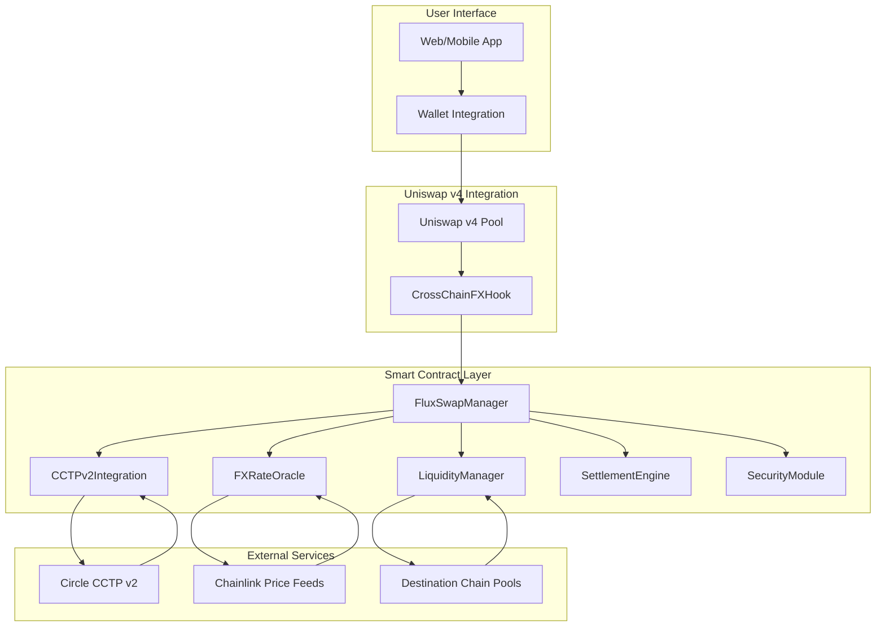
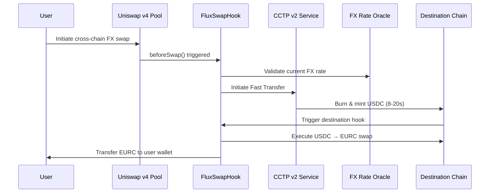
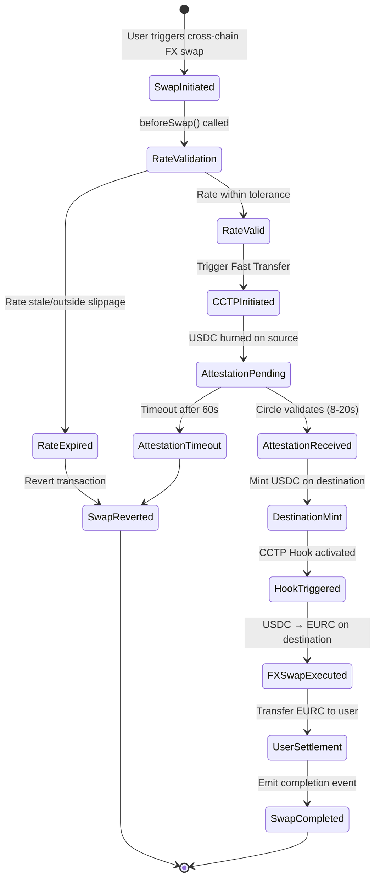

# FluxSwap Development Documentation

## Table of Contents
1. [Project Overview](#project-overview)
2. [Technical Architecture](#technical-architecture)
3. [CCTP v2 Integration Guide](#cctp-v2-integration-guide)
4. [Uniswap v4 Hook Implementation](#uniswap-v4-hook-implementation)
5. [Smart Contract Specifications](#smart-contract-specifications)
6. [Implementation Timeline](#implementation-timeline)
7. [Security Considerations](#security-considerations)
8. [Testing Strategy](#testing-strategy)
9. [Deployment Guide](#deployment-guide)
10. [API References](#api-references)

---

## Project Overview

FluxSwap is a revolutionary DeFi protocol that enables **real-time foreign exchange swaps** between USDC and EURC across multiple blockchains using Circle's **Cross-Chain Transfer Protocol v2 (CCTP v2)** and **Uniswap v4 hooks**.

### Key Innovation
- **Real-Time FX Settlement**: Sub-10 second cross-chain stablecoin swaps
- **CCTP v2 Fast Transfer**: 8-20 second settlement vs traditional 13-19 minutes
- **Automated Hooks**: Post-transfer actions triggered automatically on destination chains
- **Unified Liquidity**: Single interface for multi-chain stablecoin operations

### Target Use Cases
1. **Cross-Border Payments**: Instant USD→EUR transfers for global commerce
2. **Decentralized Neobanks**: Multi-currency account management
3. **Global Payroll Platforms**: Real-time international salary distributions
4. **DeFi Yield Optimization**: Cross-chain stablecoin farming strategies

---

## Technical Architecture

### Core Components Overview



### System Flow Architecture



---

## CCTP v2 Integration Guide

### Overview of CCTP v2 Features

Circle's CCTP v2 launched **March 11, 2025** with revolutionary improvements:

| Feature | CCTP v1 | CCTP v2 |
|---------|---------|---------|
| **Transfer Speed** | 13-19 minutes (hard finality) | **8-20 seconds (Fast Transfer)** |
| **Composability** | Limited | **Hooks for automated actions** |
| **Supported Networks** | 11 chains | **13+ chains including Solana** |
| **Capital Efficiency** | Standard burn/mint | **Fast Transfer Allowance** |

### Fast Transfer Implementation

#### 1. Fast Transfer Flow
```solidity
// CCTP v2 Fast Transfer Process
1. User initiates Fast Transfer
2. USDC burned on source chain
3. Circle's Attestation Service provides instant attestation (soft finality)
4. Fast Transfer Allowance backs the transfer temporarily
5. USDC minted on destination chain (8-20 seconds)
6. Hook triggers automated FX conversion
7. Fast Transfer Allowance replenished on hard finality
```

#### 2. Supported Networks
**Fast Transfer (Source & Destination):**
- Arbitrum, Base, Codex, Ethereum, Linea, OP Mainnet
- Polygon PoS, Solana, Unichain, World Chain

**Fast Transfer (Destination Only):**
- Avalanche, Sei, Sonic

### CCTP v2 Smart Contract Integration

```solidity
// CCTPv2Integration.sol - Key Functions
interface ICCTPv2 {
    function initiateFastTransfer(
        uint256 amount,
        uint32 destinationDomain,
        bytes32 recipient,
        bytes calldata hookData
    ) external returns (uint64 nonce);
    
    function receiveMessage(
        bytes calldata message,
        bytes calldata attestation
    ) external returns (bool success);
    
    function executeHookAction(
        uint32 sourceDomain,
        bytes32 sender,
        bytes calldata messageBody
    ) external;
}
```

### CCTP v2 Hooks System

**Hooks enable automated post-transfer actions:**
- Automatic token swaps on destination chains
- DeFi protocol interactions (lending, staking)
- NFT purchases and marketplace listings
- Multi-step cross-chain workflows

---

## Uniswap v4 Hook Implementation

### BaseHook Architecture

Uniswap v4 introduces a powerful hook system allowing custom logic injection at key points in the AMM lifecycle. Our `CrossChainFXHook` leverages the `beforeSwap` hook to intercept and redirect transactions to CCTP v2.

```solidity
// CrossChainFXHook.sol - Core Implementation
pragma solidity ^0.8.24;

import {BaseHook} from "v4-periphery/src/base/hooks/BaseHook.sol";
import {Hooks} from "v4-core/src/libraries/Hooks.sol";
import {IPoolManager} from "v4-core/src/interfaces/IPoolManager.sol";
import {PoolKey} from "v4-core/src/types/PoolKey.sol";
import {BeforeSwapDelta, BeforeSwapDeltaLibrary} from "v4-core/src/types/BeforeSwapDelta.sol";

contract CrossChainFXHook is BaseHook {
    using PoolIdLibrary for PoolKey;

    // State variables
    ICCTPv2Integration public cctpIntegration;
    IFXRateOracle public fxOracle;
    ISecurityModule public security;
    
    // Events
    event CrossChainSwapInitiated(
        address indexed user,
        address indexed sourceToken,
        address indexed targetToken,
        uint256 amount,
        uint32 destinationChain
    );

    constructor(IPoolManager _poolManager) BaseHook(_poolManager) {}

    function getHookPermissions() 
        public pure override 
        returns (Hooks.Permissions memory) 
    {
        return Hooks.Permissions({
            beforeSwap: true,
            afterSwap: false,
            beforeAddLiquidity: false,
            afterAddLiquidity: false,
            beforeRemoveLiquidity: false,
            afterRemoveLiquidity: false,
            beforeDonate: false,
            afterDonate: false
        });
    }

    function beforeSwap(
        address sender,
        PoolKey calldata key,
        IPoolManager.SwapParams calldata params,
        bytes calldata hookData
    ) external override returns (bytes4, BeforeSwapDelta, uint24) {
        // 1. Decode cross-chain intent from hookData
        (
            address targetToken,
            uint32 destinationChain,
            address recipient,
            uint256 maxSlippage
        ) = abi.decode(hookData, (address, uint32, address, uint256));

        // 2. Security validations
        require(security.checkTransactionLimits(sender, uint256(params.amountSpecified), 24 hours), "Transaction limits exceeded");
        
        // 3. Validate FX rate and slippage
        uint256 currentRate = fxOracle.getLatestRate(key.currency0, targetToken);
        require(
            fxOracle.validateRateWithSlippage(key.currency0, targetToken, currentRate, maxSlippage),
            "Rate slippage too high"
        );

        // 4. Initiate CCTP v2 Fast Transfer
        bytes memory cctpHookData = abi.encode(
            targetToken,
            recipient,
            currentRate,
            block.timestamp + 300 // 5 minute expiry
        );
        
        uint64 nonce = cctpIntegration.initiateFastTransfer(
            uint256(params.amountSpecified),
            destinationChain,
            bytes32(uint256(uint160(address(this)))),
            cctpHookData
        );

        // 5. Emit event for frontend tracking
        emit CrossChainSwapInitiated(
            sender,
            address(key.currency0),
            targetToken,
            uint256(params.amountSpecified),
            destinationChain
        );

        // 6. Skip the local swap - redirect to CCTP
        return (
            BaseHook.beforeSwap.selector,
            BeforeSwapDeltaLibrary.ZERO_DELTA,
            0
        );
    }
}
```

### Hook State Machine



---

## Smart Contract Specifications

### 1. FluxSwapManager.sol

**Role**: Main orchestrator and entry point for all cross-chain FX operations

```solidity
pragma solidity ^0.8.24;

import "@openzeppelin/contracts/access/Ownable.sol";
import "@openzeppelin/contracts/security/ReentrancyGuard.sol";
import "@openzeppelin/contracts/security/Pausable.sol";

contract FluxSwapManager is Ownable, ReentrancyGuard, Pausable {
    // State variables
    ICCTPv2Integration public cctpIntegration;
    IFXRateOracle public fxOracle;
    ILiquidityManager public liquidityManager;
    ISettlementEngine public settlementEngine;
    ISecurityModule public securityModule;
    
    // Fee configuration
    uint256 public platformFeeRate = 8; // 0.08% = 8 basis points
    uint256 constant BASIS_POINTS = 10000;
    
    // Cross-chain swap tracking
    mapping(bytes32 => SwapInfo) public swaps;
    
    struct SwapInfo {
        address user;
        address sourceToken;
        address targetToken;
        uint256 amount;
        uint32 destinationChain;
        SwapStatus status;
        uint256 timestamp;
        uint256 executionRate;
    }
    
    enum SwapStatus {
        Initiated,
        CCTPTransferring,
        DestinationProcessing,
        Completed,
        Failed
    }
    
    // Events
    event CrossChainFXSwapInitiated(
        bytes32 indexed swapId,
        address indexed user,
        address sourceToken,
        address targetToken,
        uint256 amount,
        uint32 destinationChain
    );
    
    event SwapStatusUpdated(
        bytes32 indexed swapId,
        SwapStatus status
    );

    function initiateCrossChainFXSwap(
        address sourceToken,
        address targetToken,
        uint256 amount,
        uint32 destinationDomain,
        address recipient,
        uint256 maxSlippage
    ) external nonReentrant whenNotPaused returns (bytes32 swapId) {
        // Generate unique swap ID
        swapId = keccak256(abi.encodePacked(
            msg.sender,
            sourceToken,
            targetToken,
            amount,
            destinationDomain,
            block.timestamp,
            block.number
        ));
        
        // Security checks
        require(
            securityModule.checkTransactionLimits(msg.sender, amount, 24 hours),
            "Transaction limits exceeded"
        );
        
        // Validate FX rate
        uint256 currentRate = fxOracle.getLatestRate(sourceToken, targetToken);
        require(
            fxOracle.validateRateWithSlippage(sourceToken, targetToken, currentRate, maxSlippage),
            "Rate slippage too high"
        );
        
        // Calculate optimal route
        SettlementEngine.RouteInfo memory route = settlementEngine.calculateOptimalRoute(
            sourceToken,
            targetToken,
            amount,
            _getSupportedChains()
        );
        
        // Store swap info
        swaps[swapId] = SwapInfo({
            user: msg.sender,
            sourceToken: sourceToken,
            targetToken: targetToken,
            amount: amount,
            destinationChain: destinationDomain,
            status: SwapStatus.Initiated,
            timestamp: block.timestamp,
            executionRate: currentRate
        });
        
        // Execute settlement
        bool success = settlementEngine.executeSettlement(swapId, route);
        require(success, "Settlement execution failed");
        
        // Update status
        swaps[swapId].status = SwapStatus.CCTPTransferring;
        
        emit CrossChainFXSwapInitiated(
            swapId,
            msg.sender,
            sourceToken,
            targetToken,
            amount,
            destinationDomain
        );
        
        return swapId;
    }
    
    function getSwapStatus(bytes32 swapId) 
        external view 
        returns (SwapInfo memory) 
    {
        return swaps[swapId];
    }
    
    function emergencyPause() external onlyOwner {
        _pause();
    }
    
    function updateFeeStructure(uint256 newFeeRate) external onlyOwner {
        require(newFeeRate <= 100, "Fee rate too high"); // Max 1%
        platformFeeRate = newFeeRate;
    }
}
```

### 2. CCTPv2Integration.sol

**Role**: Direct interface with Circle's Cross-Chain Transfer Protocol v2

```solidity
pragma solidity ^0.8.24;

interface ITokenMessenger {
    function depositForBurnWithCaller(
        uint256 amount,
        uint32 destinationDomain,
        bytes32 mintRecipient,
        address burnToken,
        bytes32 destinationCaller
    ) external returns (uint64 nonce);
}

interface IMessageTransmitter {
    function receiveMessage(
        bytes calldata message,
        bytes calldata attestation
    ) external returns (bool success);
}

contract CCTPv2Integration {
    ITokenMessenger public tokenMessenger;
    IMessageTransmitter public messageTransmitter;
    
    // CCTP v2 domain mappings
    mapping(uint256 => uint32) public chainToDomain;
    mapping(uint32 => uint256) public domainToChain;
    
    // Fast Transfer tracking
    mapping(uint64 => TransferInfo) public transfers;
    
    struct TransferInfo {
        address sender;
        uint256 amount;
        uint32 destinationDomain;
        bytes hookData;
        uint256 timestamp;
        bool completed;
    }
    
    // Events
    event FastTransferInitiated(
        uint64 indexed nonce,
        address indexed sender,
        uint256 amount,
        uint32 destinationDomain
    );
    
    event FastTransferCompleted(
        uint64 indexed nonce,
        bool success
    );

    constructor(
        address _tokenMessenger,
        address _messageTransmitter
    ) {
        tokenMessenger = ITokenMessenger(_tokenMessenger);
        messageTransmitter = IMessageTransmitter(_messageTransmitter);
        
        // Initialize chain/domain mappings for CCTP v2
        _initializeChainMappings();
    }

    function initiateFastTransfer(
        uint256 amount,
        uint32 destinationDomain,
        bytes32 recipient,
        bytes calldata hookData
    ) external returns (uint64 nonce) {
        // Validate destination domain
        require(domainToChain[destinationDomain] != 0, "Unsupported destination");
        
        // Store transfer info for tracking
        transfers[nonce] = TransferInfo({
            sender: msg.sender,
            amount: amount,
            destinationDomain: destinationDomain,
            hookData: hookData,
            timestamp: block.timestamp,
            completed: false
        });
        
        // Initiate CCTP Fast Transfer
        nonce = tokenMessenger.depositForBurnWithCaller(
            amount,
            destinationDomain,
            recipient,
            USDC_ADDRESS,
            bytes32(uint256(uint160(address(this))))
        );
        
        emit FastTransferInitiated(nonce, msg.sender, amount, destinationDomain);
        return nonce;
    }

    function receiveMessage(
        bytes calldata message,
        bytes calldata attestation
    ) external returns (bool success) {
        // Verify and process CCTP message
        success = messageTransmitter.receiveMessage(message, attestation);
        
        if (success) {
            // Decode message to extract transfer details
            (uint64 nonce, , ) = _decodeMessage(message);
            
            // Execute hook action if specified
            if (transfers[nonce].hookData.length > 0) {
                _executeHookAction(nonce);
            }
            
            transfers[nonce].completed = true;
            emit FastTransferCompleted(nonce, true);
        }
        
        return success;
    }

    function executeHookAction(
        uint32 sourceDomain,
        bytes32 sender,
        bytes calldata messageBody
    ) external {
        // Decode hook data and execute automated actions
        (
            address targetToken,
            address recipient,
            uint256 expectedRate,
            uint256 expiry
        ) = abi.decode(messageBody, (address, address, uint256, uint256));
        
        require(block.timestamp <= expiry, "Hook action expired");
        
        // Execute FX conversion on destination chain
        _executeFXConversion(targetToken, recipient, expectedRate);
    }
    
    function _initializeChainMappings() private {
        // CCTP v2 supported chains and domains
        chainToDomain[1] = 0;      // Ethereum
        chainToDomain[42161] = 3;  // Arbitrum
        chainToDomain[8453] = 6;   // Base
        chainToDomain[10] = 2;     // OP Mainnet
        chainToDomain[137] = 7;    // Polygon PoS
        
        // Reverse mappings
        domainToChain[0] = 1;      // Ethereum
        domainToChain[3] = 42161;  // Arbitrum
        domainToChain[6] = 8453;   // Base
        domainToChain[2] = 10;     // OP Mainnet
        domainToChain[7] = 137;    // Polygon PoS
    }
}
```

### 3. FXRateOracle.sol

**Role**: Real-time foreign exchange rate provider with built-in safety mechanisms

```solidity
pragma solidity ^0.8.24;

import "@chainlink/contracts/src/v0.8/interfaces/AggregatorV3Interface.sol";

contract FXRateOracle {
    // Price feed interfaces
    mapping(address => AggregatorV3Interface) public priceFeeds;
    
    // TWAP configuration
    uint256 public constant TWAP_WINDOW = 3600; // 1 hour
    uint256 public constant MAX_PRICE_AGE = 300; // 5 minutes
    uint256 public constant MAX_SLIPPAGE = 1000; // 10% = 1000 basis points
    
    // Rate validation parameters
    uint256 public constant BASIS_POINTS = 10000;
    
    // Events
    event RateUpdated(
        address indexed baseToken,
        address indexed quoteToken,
        uint256 rate,
        uint256 timestamp
    );
    
    // Historical rate tracking for TWAP
    struct RateHistory {
        uint256 rate;
        uint256 timestamp;
    }
    
    mapping(bytes32 => RateHistory[]) public rateHistory;

    constructor() {
        // Initialize Chainlink price feeds for major stablecoins
        _initializePriceFeeds();
    }

    function getLatestRate(
        address baseToken,
        address quoteToken
    ) external view returns (uint256 rate, uint256 timestamp) {
        // For USDC/EURC, we need to fetch EUR/USD rate from Chainlink
        if (baseToken == USDC_ADDRESS && quoteToken == EURC_ADDRESS) {
            return _getEURUSDRate();
        } else if (baseToken == EURC_ADDRESS && quoteToken == USDC_ADDRESS) {
            (uint256 eurUsdRate, uint256 ts) = _getEURUSDRate();
            return (BASIS_POINTS * BASIS_POINTS / eurUsdRate, ts);
        }
        
        revert("Unsupported token pair");
    }

    function validateRateWithSlippage(
        address baseToken,
        address quoteToken,
        uint256 expectedRate,
        uint256 maxSlippage
    ) external view returns (bool valid) {
        require(maxSlippage <= MAX_SLIPPAGE, "Slippage too high");
        
        (uint256 currentRate, uint256 timestamp) = this.getLatestRate(baseToken, quoteToken);
        
        // Check rate freshness
        require(block.timestamp - timestamp <= MAX_PRICE_AGE, "Rate too stale");
        
        // Calculate slippage
        uint256 slippage;
        if (currentRate > expectedRate) {
            slippage = ((currentRate - expectedRate) * BASIS_POINTS) / expectedRate;
        } else {
            slippage = ((expectedRate - currentRate) * BASIS_POINTS) / expectedRate;
        }
        
        return slippage <= maxSlippage;
    }

    function getTWAPRate(
        address baseToken,
        address quoteToken,
        uint256 duration
    ) external view returns (uint256 twapRate) {
        require(duration <= TWAP_WINDOW, "Duration too long");
        
        bytes32 pairKey = keccak256(abi.encodePacked(baseToken, quoteToken));
        RateHistory[] memory history = rateHistory[pairKey];
        
        uint256 cutoffTime = block.timestamp - duration;
        uint256 weightedSum = 0;
        uint256 totalWeight = 0;
        
        for (uint256 i = history.length; i > 0; i--) {
            if (history[i-1].timestamp < cutoffTime) break;
            
            uint256 weight = history[i-1].timestamp - (i > 1 ? history[i-2].timestamp : cutoffTime);
            weightedSum += history[i-1].rate * weight;
            totalWeight += weight;
        }
        
        require(totalWeight > 0, "No recent rate data");
        return weightedSum / totalWeight;
    }
    
    function _getEURUSDRate() private view returns (uint256 rate, uint256 timestamp) {
        AggregatorV3Interface priceFeed = priceFeeds[address(EURC_ADDRESS)];
        require(address(priceFeed) != address(0), "Price feed not found");
        
        (
            uint80 roundId,
            int256 price,
            uint256 startedAt,
            uint256 updatedAt,
            uint80 answeredInRound
        ) = priceFeed.latestRoundData();
        
        require(price > 0, "Invalid price");
        require(updatedAt > 0, "Round not complete");
        
        // Chainlink EUR/USD price has 8 decimals, normalize to 18 decimals
        return (uint256(price) * 1e10, updatedAt);
    }
    
    function _initializePriceFeeds() private {
        // Ethereum mainnet Chainlink EUR/USD feed
        priceFeeds[EURC_ADDRESS] = AggregatorV3Interface(0xb49f677943BC038e9857d61E7d053CaA2C1734C1);
        
        // Additional feeds can be added for other networks
    }
}
```

### 4. LiquidityManager.sol

**Role**: Cross-chain liquidity optimization and rebalancing system

```solidity
pragma solidity ^0.8.24;

import "@openzeppelin/contracts/token/ERC20/IERC20.sol";
import "@openzeppelin/contracts/token/ERC20/ERC20.sol";

contract LiquidityManager is ERC20 {
    // Liquidity pool information per chain
    struct PoolInfo {
        uint256 usdcReserves;
        uint256 eurcReserves;
        uint256 totalLiquidity;
        uint256 utilizationRate; // Basis points
        uint256 lastRebalanceTime;
        bool active;
    }
    
    // Chain-specific pool data
    mapping(uint32 => PoolInfo) public pools;
    mapping(address => mapping(uint32 => uint256)) public userLiquidity;
    
    // Rebalancing configuration
    uint256 public constant REBALANCE_THRESHOLD = 8000; // 80% utilization
    uint256 public constant OPTIMAL_UTILIZATION = 6000; // 60% target
    uint256 public constant REBALANCE_COOLDOWN = 1 hours;
    uint256 public constant BASIS_POINTS = 10000;
    
    // Dependencies
    ICCTPv2Integration public cctpIntegration;
    ISettlementEngine public settlementEngine;
    
    // Events
    event LiquidityAdded(
        address indexed provider,
        uint32 indexed chainId,
        address token,
        uint256 amount,
        uint256 lpTokens
    );
    
    event LiquidityRemoved(
        address indexed provider,
        uint32 indexed chainId,
        uint256 lpTokens,
        uint256 amount
    );
    
    event RebalanceExecuted(
        uint32 indexed sourceChain,
        uint32 indexed destinationChain,
        address token,
        uint256 amount
    );

    constructor(string memory name, string memory symbol) ERC20(name, symbol) {}

    function addLiquidity(
        address token,
        uint256 amount,
        uint32 targetChain
    ) external returns (uint256 lpTokens) {
        require(pools[targetChain].active, "Chain not supported");
        require(token == USDC_ADDRESS || token == EURC_ADDRESS, "Unsupported token");
        
        // Transfer tokens from user
        IERC20(token).transferFrom(msg.sender, address(this), amount);
        
        // Calculate LP tokens based on current pool ratio
        PoolInfo storage pool = pools[targetChain];
        
        if (totalSupply() == 0) {
            lpTokens = amount * 1e12; // Initial liquidity multiplier
        } else {
            uint256 totalValue = pool.usdcReserves + pool.eurcReserves; // Simplified 1:1 assumption
            lpTokens = (amount * totalSupply()) / totalValue;
        }
        
        // Update pool reserves
        if (token == USDC_ADDRESS) {
            pool.usdcReserves += amount;
        } else {
            pool.eurcReserves += amount;
        }
        
        pool.totalLiquidity += amount;
        userLiquidity[msg.sender][targetChain] += lpTokens;
        
        // Mint LP tokens
        _mint(msg.sender, lpTokens);
        
        emit LiquidityAdded(msg.sender, targetChain, token, amount, lpTokens);
        return lpTokens;
    }

    function removeLiquidity(
        uint256 lpTokens,
        uint32 chainId
    ) external returns (uint256 amount) {
        require(lpTokens > 0, "Invalid LP token amount");
        require(userLiquidity[msg.sender][chainId] >= lpTokens, "Insufficient balance");
        
        PoolInfo storage pool = pools[chainId];
        uint256 totalValue = pool.usdcReserves + pool.eurcReserves;
        
        // Calculate withdrawal amount
        amount = (lpTokens * totalValue) / totalSupply();
        
        // Update pool reserves (proportional withdrawal)
        uint256 usdcWithdrawal = (amount * pool.usdcReserves) / totalValue;
        uint256 eurcWithdrawal = amount - usdcWithdrawal;
        
        pool.usdcReserves -= usdcWithdrawal;
        pool.eurcReserves -= eurcWithdrawal;
        pool.totalLiquidity -= amount;
        userLiquidity[msg.sender][chainId] -= lpTokens;
        
        // Burn LP tokens
        _burn(msg.sender, lpTokens);
        
        // Transfer tokens back to user
        if (usdcWithdrawal > 0) {
            IERC20(USDC_ADDRESS).transfer(msg.sender, usdcWithdrawal);
        }
        if (eurcWithdrawal > 0) {
            IERC20(EURC_ADDRESS).transfer(msg.sender, eurcWithdrawal);
        }
        
        emit LiquidityRemoved(msg.sender, chainId, lpTokens, amount);
        return amount;
    }

    function rebalanceLiquidity(
        uint32 sourceChain,
        uint32 destinationChain,
        address token,
        uint256 amount
    ) external onlyAuthorized {
        require(pools[sourceChain].active && pools[destinationChain].active, "Invalid chains");
        require(
            block.timestamp >= pools[sourceChain].lastRebalanceTime + REBALANCE_COOLDOWN,
            "Rebalance on cooldown"
        );
        
        PoolInfo storage sourcePool = pools[sourceChain];
        PoolInfo storage destPool = pools[destinationChain];
        
        // Validate rebalancing need
        require(
            sourcePool.utilizationRate > REBALANCE_THRESHOLD ||
            destPool.utilizationRate < OPTIMAL_UTILIZATION,
            "Rebalancing not needed"
        );
        
        // Execute cross-chain transfer via CCTP
        bytes memory hookData = abi.encode(token, address(this), amount, block.timestamp + 300);
        
        cctpIntegration.initiateFastTransfer(
            amount,
            destinationChain,
            bytes32(uint256(uint160(address(this)))),
            hookData
        );
        
        // Update pool balances
        if (token == USDC_ADDRESS) {
            sourcePool.usdcReserves -= amount;
            destPool.usdcReserves += amount;
        } else {
            sourcePool.eurcReserves -= amount;
            destPool.eurcReserves += amount;
        }
        
        sourcePool.lastRebalanceTime = block.timestamp;
        
        emit RebalanceExecuted(sourceChain, destinationChain, token, amount);
    }

    function calculateOptimalRebalancing() external view returns (RebalanceAction[] memory actions) {
        // Implementation for calculating optimal rebalancing strategy
        // Returns array of recommended rebalancing actions
        
        uint256 actionCount = 0;
        uint32[] memory activeChains = _getActiveChains();
        
        // Count needed actions
        for (uint256 i = 0; i < activeChains.length; i++) {
            for (uint256 j = i + 1; j < activeChains.length; j++) {
                if (_needsRebalancing(activeChains[i], activeChains[j])) {
                    actionCount++;
                }
            }
        }
        
        actions = new RebalanceAction[](actionCount);
        uint256 index = 0;
        
        // Populate actions
        for (uint256 i = 0; i < activeChains.length; i++) {
            for (uint256 j = i + 1; j < activeChains.length; j++) {
                if (_needsRebalancing(activeChains[i], activeChains[j])) {
                    actions[index] = _calculateRebalanceAction(activeChains[i], activeChains[j]);
                    index++;
                }
            }
        }
        
        return actions;
    }
    
    struct RebalanceAction {
        uint32 sourceChain;
        uint32 destinationChain;
        address token;
        uint256 amount;
        uint256 priority; // Higher number = higher priority
    }
    
    function _needsRebalancing(uint32 chainA, uint32 chainB) private view returns (bool) {
        PoolInfo memory poolA = pools[chainA];
        PoolInfo memory poolB = pools[chainB];
        
        return (poolA.utilizationRate > REBALANCE_THRESHOLD && poolB.utilizationRate < OPTIMAL_UTILIZATION) ||
               (poolB.utilizationRate > REBALANCE_THRESHOLD && poolA.utilizationRate < OPTIMAL_UTILIZATION);
    }
    
    modifier onlyAuthorized() {
        // Implementation for access control
        require(msg.sender == owner() || msg.sender == address(settlementEngine), "Not authorized");
        _;
    }
}
```

### 5. SettlementEngine.sol

**Role**: Intelligent routing and settlement optimization engine

```solidity
pragma solidity ^0.8.24;

contract SettlementEngine {
    // Route optimization parameters
    struct RouteInfo {
        uint32[] chainPath;
        address[] tokenPath;
        uint256[] amounts;
        uint256 totalGasCost;
        uint256 estimatedTime;
        uint256 slippage;
        uint256 score; // Higher = better route
    }
    
    // Gas cost estimates per chain (in wei equivalent)
    mapping(uint32 => uint256) public gasEstimates;
    
    // Network performance metrics
    struct NetworkMetrics {
        uint256 avgConfirmationTime;
        uint256 successRate; // Basis points
        uint256 congestionLevel;
        uint256 lastUpdate;
    }
    
    mapping(uint32 => NetworkMetrics) public networkMetrics;
    
    // Dependencies
    ILiquidityManager public liquidityManager;
    IFXRateOracle public fxOracle;
    ICCTPv2Integration public cctpIntegration;
    
    // Events
    event RouteCalculated(
        bytes32 indexed swapId,
        RouteInfo route
    );
    
    event SettlementExecuted(
        bytes32 indexed swapId,
        bool success,
        uint256 executionTime
    );

    function calculateOptimalRoute(
        address sourceToken,
        address targetToken,
        uint256 amount,
        uint32[] calldata availableChains
    ) external view returns (RouteInfo memory optimalRoute) {
        require(availableChains.length > 0, "No chains available");
        
        // Direct route evaluation
        RouteInfo memory directRoute = _evaluateDirectRoute(
            sourceToken,
            targetToken,
            amount,
            availableChains
        );
        
        // Multi-hop route evaluation (if needed)
        RouteInfo memory multiHopRoute = _evaluateMultiHopRoute(
            sourceToken,
            targetToken,
            amount,
            availableChains
        );
        
        // Select optimal route based on score
        return directRoute.score >= multiHopRoute.score ? directRoute : multiHopRoute;
    }

    function executeSettlement(
        bytes32 swapId,
        RouteInfo calldata route
    ) external returns (bool success) {
        uint256 startTime = block.timestamp;
        
        try this._executeSettlementInternal(swapId, route) {
            success = true;
        } catch {
            success = false;
        }
        
        uint256 executionTime = block.timestamp - startTime;
        emit SettlementExecuted(swapId, success, executionTime);
        
        return success;
    }

    function batchSettlements(
        bytes32[] calldata swapIds
    ) external returns (uint256 successCount) {
        for (uint256 i = 0; i < swapIds.length; i++) {
            // Get route info for each swap
            RouteInfo memory route = _getStoredRoute(swapIds[i]);
            
            if (executeSettlement(swapIds[i], route)) {
                successCount++;
            }
        }
        
        return successCount;
    }
    
    function _evaluateDirectRoute(
        address sourceToken,
        address targetToken,
        uint256 amount,
        uint32[] memory availableChains
    ) private view returns (RouteInfo memory bestRoute) {
        uint256 bestScore = 0;
        
        for (uint256 i = 0; i < availableChains.length; i++) {
            uint32 chain = availableChains[i];
            
            // Check liquidity availability
            (uint256 available, uint256 rate) = _checkLiquidityAndRate(
                sourceToken,
                targetToken,
                amount,
                chain
            );
            
            if (available < amount) continue;
            
            // Calculate route metrics
            uint256 gasCost = gasEstimates[chain];
            NetworkMetrics memory metrics = networkMetrics[chain];
            
            // Score calculation (higher is better)
            uint256 score = _calculateRouteScore(
                gasCost,
                metrics.avgConfirmationTime,
                metrics.successRate,
                rate,
                amount
            );
            
            if (score > bestScore) {
                bestScore = score;
                bestRoute = RouteInfo({
                    chainPath: new uint32[](1),
                    tokenPath: new address[](2),
                    amounts: new uint256[](1),
                    totalGasCost: gasCost,
                    estimatedTime: metrics.avgConfirmationTime,
                    slippage: _calculateSlippage(rate, amount),
                    score: score
                });
                
                bestRoute.chainPath[0] = chain;
                bestRoute.tokenPath[0] = sourceToken;
                bestRoute.tokenPath[1] = targetToken;
                bestRoute.amounts[0] = amount;
            }
        }
        
        return bestRoute;
    }
    
    function _evaluateMultiHopRoute(
        address sourceToken,
        address targetToken,
        uint256 amount,
        uint32[] memory availableChains
    ) private view returns (RouteInfo memory bestRoute) {
        // Implementation for multi-hop routing
        // This is a simplified version - full implementation would use dynamic programming
        
        if (availableChains.length < 2) {
            return bestRoute; // No multi-hop possible
        }
        
        // Find best 2-hop route
        uint256 bestScore = 0;
        
        for (uint256 i = 0; i < availableChains.length; i++) {
            for (uint256 j = 0; j < availableChains.length; j++) {
                if (i == j) continue;
                
                uint32 intermediateChain = availableChains[i];
                uint32 finalChain = availableChains[j];
                
                // Check intermediate liquidity (source -> USDC)
                (uint256 intermediateAvailable, uint256 intermediateRate) = _checkLiquidityAndRate(
                    sourceToken,
                    USDC_ADDRESS,
                    amount,
                    intermediateChain
                );
                
                if (intermediateAvailable < amount) continue;
                
                // Calculate intermediate amount
                uint256 intermediateAmount = (amount * intermediateRate) / 1e18;
                
                // Check final liquidity (USDC -> target)
                (uint256 finalAvailable, uint256 finalRate) = _checkLiquidityAndRate(
                    USDC_ADDRESS,
                    targetToken,
                    intermediateAmount,
                    finalChain
                );
                
                if (finalAvailable < intermediateAmount) continue;
                
                // Calculate total costs and time
                uint256 totalGasCost = gasEstimates[intermediateChain] + gasEstimates[finalChain];
                uint256 totalTime = networkMetrics[intermediateChain].avgConfirmationTime + 
                                  networkMetrics[finalChain].avgConfirmationTime;
                
                // Calculate combined success rate
                uint256 combinedSuccessRate = (networkMetrics[intermediateChain].successRate * 
                                             networkMetrics[finalChain].successRate) / BASIS_POINTS;
                
                uint256 score = _calculateRouteScore(
                    totalGasCost,
                    totalTime,
                    combinedSuccessRate,
                    (intermediateRate * finalRate) / 1e18,
                    amount
                );
                
                if (score > bestScore) {
                    bestScore = score;
                    bestRoute = RouteInfo({
                        chainPath: new uint32[](2),
                        tokenPath: new address[](3),
                        amounts: new uint256[](2),
                        totalGasCost: totalGasCost,
                        estimatedTime: totalTime,
                        slippage: _calculateMultiHopSlippage(intermediateRate, finalRate, amount),
                        score: score
                    });
                    
                    bestRoute.chainPath[0] = intermediateChain;
                    bestRoute.chainPath[1] = finalChain;
                    bestRoute.tokenPath[0] = sourceToken;
                    bestRoute.tokenPath[1] = USDC_ADDRESS;
                    bestRoute.tokenPath[2] = targetToken;
                    bestRoute.amounts[0] = amount;
                    bestRoute.amounts[1] = intermediateAmount;
                }
            }
        }
        
        return bestRoute;
    }
    
    function _calculateRouteScore(
        uint256 gasCost,
        uint256 estimatedTime,
        uint256 successRate,
        uint256 exchangeRate,
        uint256 amount
    ) private pure returns (uint256 score) {
        // Scoring algorithm (higher is better)
        // Factors: low gas cost, fast execution, high success rate, good exchange rate
        
        uint256 gasScore = gasCost > 0 ? (1e18 * 1e9) / gasCost : 1e18; // Higher for lower gas
        uint256 timeScore = estimatedTime > 0 ? (1e18 * 60) / estimatedTime : 1e18; // Higher for faster
        uint256 reliabilityScore = successRate * 1e14; // Convert basis points to 18 decimals
        uint256 rateScore = exchangeRate; // Direct rate value
        
        // Weighted combination
        score = (gasScore * 20 + timeScore * 30 + reliabilityScore * 30 + rateScore * 20) / 100;
        
        return score;
    }
    
    function _executeSettlementInternal(
        bytes32 swapId,
        RouteInfo calldata route
    ) external {
        require(msg.sender == address(this), "Internal call only");
        
        if (route.chainPath.length == 1) {
            // Direct settlement
            _executeDirectSettlement(swapId, route);
        } else {
            // Multi-hop settlement
            _executeMultiHopSettlement(swapId, route);
        }
    }
    
    function _executeDirectSettlement(bytes32 swapId, RouteInfo calldata route) private {
        // Execute direct cross-chain settlement
        bytes memory hookData = abi.encode(
            route.tokenPath[1], // target token
            msg.sender,         // recipient
            route.amounts[0],   // amount
            block.timestamp + 300 // expiry
        );
        
        cctpIntegration.initiateFastTransfer(
            route.amounts[0],
            route.chainPath[0],
            bytes32(uint256(uint160(address(this)))),
            hookData
        );
    }
    
    function _executeMultiHopSettlement(bytes32 swapId, RouteInfo calldata route) private {
        // Execute multi-hop settlement
        // First hop: source -> intermediate
        bytes memory firstHopData = abi.encode(
            route.tokenPath[1], // USDC
            address(this),      // intermediate recipient
            route.amounts[0],   // amount
            route.chainPath[1], // next hop chain
            route.tokenPath[2], // final target token
            block.timestamp + 600 // extended expiry
        );
        
        cctpIntegration.initiateFastTransfer(
            route.amounts[0],
            route.chainPath[0],
            bytes32(uint256(uint160(address(this)))),
            firstHopData
        );
    }
}
```

### 6. SecurityModule.sol

**Role**: Comprehensive security and risk management system

```solidity
pragma solidity ^0.8.24;

import "@openzeppelin/contracts/access/AccessControl.sol";
import "@openzeppelin/contracts/security/Pausable.sol";
import "@openzeppelin/contracts/utils/math/SafeMath.sol";

contract SecurityModule is AccessControl, Pausable {
    using SafeMath for uint256;
    
    // Role definitions
    bytes32 public constant ADMIN_ROLE = keccak256("ADMIN_ROLE");
    bytes32 public constant EMERGENCY_ADMIN_ROLE = keccak256("EMERGENCY_ADMIN_ROLE");
    bytes32 public constant RISK_MANAGER_ROLE = keccak256("RISK_MANAGER_ROLE");
    
    // Risk parameters
    struct RiskParams {
        uint256 dailyUserLimit;          // $100K default
        uint256 maxSingleTransaction;    // $1M default
        uint256 maxPriceDeviation;       // 10% default
        uint256 minLiquidityBuffer;      // 20% default
        uint256 emergencyThreshold;      // 50% default
        bool globalPauseEnabled;
    }
    
    RiskParams public riskParams;
    
    // User transaction tracking
    mapping(address => mapping(uint256 => uint256)) public userDailyVolume; // user -> day -> volume
    mapping(address => bool) public blacklistedAddresses;
    mapping(address => bool) public whitelistedAddresses;
    
    // System monitoring
    uint256 public totalDailyVolume;
    uint256 public systemHealthScore = 10000; // 100% = 10000 basis points
    uint256 public lastHealthUpdate;
    
    // Emergency controls
    bool public emergencyPause = false;
    uint256 public emergencyStartTime;
    mapping(bytes32 => bool) public circuitBreakers;
    
    // Events
    event EmergencyPauseTriggered(address indexed admin, string reason);
    event RiskParametersUpdated(RiskParams newParams);
    event AddressBlacklisted(address indexed addr, string reason);
    event CircuitBreakerTriggered(bytes32 indexed breakerType, address indexed trigger);
    event SystemHealthUpdated(uint256 newScore, uint256 timestamp);

    constructor() {
        _grantRole(DEFAULT_ADMIN_ROLE, msg.sender);
        _grantRole(ADMIN_ROLE, msg.sender);
        _grantRole(EMERGENCY_ADMIN_ROLE, msg.sender);
        
        // Initialize default risk parameters
        riskParams = RiskParams({
            dailyUserLimit: 100_000 * 1e6,      // $100K USDC (6 decimals)
            maxSingleTransaction: 1_000_000 * 1e6, // $1M USDC
            maxPriceDeviation: 1000,             // 10% = 1000 basis points
            minLiquidityBuffer: 2000,            // 20% = 2000 basis points
            emergencyThreshold: 5000,            // 50% = 5000 basis points
            globalPauseEnabled: true
        });
    }

    function checkTransactionLimits(
        address user,
        uint256 amount,
        uint256 timeWindow
    ) external view returns (bool withinLimits) {
        // Check global pause
        if (emergencyPause || paused()) {
            return false;
        }
        
        // Check blacklist
        if (blacklistedAddresses[user]) {
            return false;
        }
        
        // Whitelist bypass
        if (whitelistedAddresses[user]) {
            return true;
        }
        
        // Check single transaction limit
        if (amount > riskParams.maxSingleTransaction) {
            return false;
        }
        
        // Check daily limit
        uint256 today = block.timestamp / 1 days;
        if (userDailyVolume[user][today].add(amount) > riskParams.dailyUserLimit) {
            return false;
        }
        
        return true;
    }

    function triggerEmergencyPause(
        string calldata reason
    ) external onlyRole(EMERGENCY_ADMIN_ROLE) {
        require(!emergencyPause, "Already paused");
        
        emergencyPause = true;
        emergencyStartTime = block.timestamp;
        
        // Pause all contract operations
        _pause();
        
        emit EmergencyPauseTriggered(msg.sender, reason);
    }

    function updateRiskParameters(
        RiskParams calldata newParams
    ) external onlyRole(ADMIN_ROLE) {
        // Validate parameters
        require(newParams.dailyUserLimit > 0, "Invalid daily limit");
        require(newParams.maxSingleTransaction > 0, "Invalid transaction limit");
        require(newParams.maxPriceDeviation <= 5000, "Price deviation too high"); // Max 50%
        
        riskParams = newParams;
        emit RiskParametersUpdated(newParams);
    }

    function blacklistAddress(
        address maliciousAddress,
        string calldata reason
    ) external onlyRole(ADMIN_ROLE) {
        require(maliciousAddress != address(0), "Invalid address");
        require(!whitelistedAddresses[maliciousAddress], "Cannot blacklist whitelisted address");
        
        blacklistedAddresses[maliciousAddress] = true;
        emit AddressBlacklisted(maliciousAddress, reason);
    }

    function whitelistAddress(address trustedAddress) external onlyRole(ADMIN_ROLE) {
        require(trustedAddress != address(0), "Invalid address");
        
        whitelistedAddresses[trustedAddress] = true;
        
        // Remove from blacklist if present
        if (blacklistedAddresses[trustedAddress]) {
            blacklistedAddresses[trustedAddress] = false;
        }
    }

    function triggerCircuitBreaker(
        bytes32 breakerType,
        string calldata reason
    ) external {
        require(
            hasRole(RISK_MANAGER_ROLE, msg.sender) || 
            hasRole(EMERGENCY_ADMIN_ROLE, msg.sender),
            "Insufficient permissions"
        );
        
        circuitBreakers[breakerType] = true;
        
        // Auto-pause if critical breaker triggered
        if (breakerType == keccak256("CRITICAL_FAILURE") || 
            breakerType == keccak256("PRICE_ORACLE_FAILURE")) {
            
            if (riskParams.globalPauseEnabled) {
                triggerEmergencyPause(reason);
            }
        }
        
        emit CircuitBreakerTriggered(breakerType, msg.sender);
    }

    function updateSystemHealth() external {
        require(
            block.timestamp >= lastHealthUpdate + 300, // 5 minute cooldown
            "Health update too frequent"
        );
        
        uint256 newScore = _calculateSystemHealth();
        systemHealthScore = newScore;
        lastHealthUpdate = block.timestamp;
        
        // Trigger emergency measures if health is critically low
        if (newScore < riskParams.emergencyThreshold) {
            triggerCircuitBreaker(
                keccak256("LOW_SYSTEM_HEALTH"),
                "System health below emergency threshold"
            );
        }
        
        emit SystemHealthUpdated(newScore, block.timestamp);
    }

    function recordTransaction(address user, uint256 amount) external onlyRole(ADMIN_ROLE) {
        uint256 today = block.timestamp / 1 days;
        userDailyVolume[user][today] = userDailyVolume[user][today].add(amount);
        totalDailyVolume = totalDailyVolume.add(amount);
    }

    function isSystemHealthy() external view returns (bool) {
        return systemHealthScore >= riskParams.emergencyThreshold && !emergencyPause;
    }
    
    function _calculateSystemHealth() private view returns (uint256 score) {
        // Health scoring based on multiple factors
        uint256 baseScore = 10000; // 100%
        
        // Deduct points for active circuit breakers
        if (circuitBreakers[keccak256("PRICE_ORACLE_FAILURE")]) {
            baseScore = baseScore.sub(3000); // -30%
        }
        
        if (circuitBreakers[keccak256("LIQUIDITY_SHORTAGE")]) {
            baseScore = baseScore.sub(2000); // -20%
        }
        
        if (circuitBreakers[keccak256("HIGH_SLIPPAGE")]) {
            baseScore = baseScore.sub(1000); // -10%
        }
        
        // Factor in recent transaction success rate
        // This would require additional tracking in production
        
        return baseScore;
    }
    
    // Recovery functions
    function resumeOperations() external onlyRole(DEFAULT_ADMIN_ROLE) {
        require(emergencyPause, "Not currently paused");
        require(systemHealthScore >= riskParams.emergencyThreshold, "System health insufficient");
        
        emergencyPause = false;
        _unpause();
        
        // Clear circuit breakers
        circuitBreakers[keccak256("CRITICAL_FAILURE")] = false;
        circuitBreakers[keccak256("PRICE_ORACLE_FAILURE")] = false;
        circuitBreakers[keccak256("LIQUIDITY_SHORTAGE")] = false;
        circuitBreakers[keccak256("HIGH_SLIPPAGE")] = false;
    }
    
    // View functions
    function getUserDailyVolume(address user) external view returns (uint256) {
        uint256 today = block.timestamp / 1 days;
        return userDailyVolume[user][today];
    }
    
    function getRemainingUserLimit(address user) external view returns (uint256) {
        if (whitelistedAddresses[user]) {
            return type(uint256).max;
        }
        
        uint256 today = block.timestamp / 1 days;
        uint256 used = userDailyVolume[user][today];
        
        return used >= riskParams.dailyUserLimit ? 0 : riskParams.dailyUserLimit.sub(used);
    }
}
```

---

## Implementation Timeline

### Phase 1: Core Infrastructure (Days 1-2)
- [ ] **Set up CCTP v2 Fast Transfer integration**
  - Install Circle CCTP contracts dependencies
  - Configure supported chain/domain mappings
  - Implement basic Fast Transfer functionality
  - Add attestation handling and message verification

- [ ] **Deploy Uniswap v4 beforeSwap hook contract**
  - Set up Uniswap v4 development environment
  - Implement CrossChainFXHook with beforeSwap logic
  - Configure hook permissions and pool integration
  - Add cross-chain intent detection and routing

- [ ] **Implement basic USDC↔EURC swap logic**
  - Create FXRateOracle with Chainlink integration
  - Add USDC/EURC pair validation and rate fetching
  - Implement slippage protection and rate validation
  - Set up basic swap execution on destination chains

- [ ] **Create mock oracle for FX rates**
  - Deploy Chainlink EUR/USD price feed integration
  - Implement TWAP calculation for rate stability
  - Add rate freshness validation and fallback mechanisms
  - Create oracle health monitoring and emergency procedures

### Phase 2: Cross-Chain Logic (Days 3-4)
- [ ] **Integrate CCTP v2 Hooks for automated settlements**
  - Implement destination chain hook execution
  - Add automated FX conversion on USDC receipt
  - Configure hook data encoding/decoding
  - Set up post-transfer action triggers

- [ ] **Build chain selection algorithm (gas optimization)**
  - Implement SettlementEngine with route optimization
  - Add gas cost estimation per supported chain
  - Create network performance metrics tracking
  - Develop multi-hop routing for optimal execution

- [ ] **Implement liquidity routing across supported networks**
  - Deploy LiquidityManager with cross-chain pools
  - Add liquidity depth monitoring and rebalancing
  - Implement JIT (just-in-time) liquidity provision
  - Create LP token system and reward distribution

- [ ] **Add slippage protection and MEV resistance**
  - Implement advanced slippage calculation and limits
  - Add transaction priority and private mempool integration
  - Create MEV protection through batch settlement
  - Deploy circuit breakers for abnormal market conditions

### Phase 3: Advanced Features (Days 5-6)
- [ ] **Real-time FX rate integration (Chainlink/API3)**
  - Deploy production Chainlink price feeds
  - Add API3 dAPI integration as backup oracle
  - Implement multi-source rate aggregation
  - Create oracle failure handling and manual overrides

- [ ] **Multi-hop routing for optimal execution**
  - Enhance SettlementEngine with complex routing
  - Add intermediate chain optimization algorithms
  - Implement route caching and performance optimization
  - Create dynamic route recalculation based on market conditions

- [ ] **Batch settlement optimization**
  - Implement transaction batching for gas efficiency
  - Add settlement queue management and prioritization
  - Create batch size optimization based on network congestion
  - Deploy automated batch execution with configurable parameters

- [ ] **Emergency pause and upgrade mechanisms**
  - Deploy comprehensive SecurityModule with role-based access
  - Implement emergency pause with timelock recovery
  - Add upgrade mechanisms with governance integration
  - Create incident response procedures and audit trails

### Phase 4: Frontend & Testing (Days 7-8)
- [ ] **React/Next.js interface with wallet integration**
  - Create responsive web interface with modern UI/UX
  - Implement wallet connection with multi-wallet support
  - Add real-time FX rate display and conversion preview
  - Create transaction history and settlement tracking

- [ ] **Real-time settlement tracking dashboard**
  - Implement WebSocket connections for live updates
  - Add transaction status visualization with progress indicators
  - Create cross-chain settlement monitoring dashboard
  - Deploy performance metrics and analytics integration

- [ ] **Comprehensive testing suite**
  - Write unit tests for all smart contracts
  - Create integration tests for cross-chain flows
  - Implement end-to-end testing with testnet deployments
  - Add load testing and performance benchmarking

- [ ] **Performance benchmarking**
  - Measure settlement times across different chains
  - Test gas optimization and cost efficiency
  - Benchmark slippage and price impact analysis
  - Create performance monitoring and alerting systems

---

## Security Considerations

### 1. CCTP v2 Native Security Features
- **Permissionless Protocol**: No trusted intermediaries or bridge risks
- **Native Burn/Mint**: Direct USDC destruction and creation by Circle
- **Fast Transfer Allowance**: Circle's capital backing for sub-finality settlements
- **Attestation Service**: Cryptographic proof of burn events

### 2. Smart Contract Security
```solidity
// Security checklist for each contract:

// Access Control
- Role-based permissions with OpenZeppelin AccessControl
- Multi-signature requirements for critical functions
- Timelock delays for parameter changes

// Reentrancy Protection  
- ReentrancyGuard on all external functions
- Checks-Effects-Interactions pattern
- State updates before external calls

// Input Validation
- Parameter bounds checking
- Address validation (non-zero, contract existence)
- Amount validation (overflow, underflow, minimum values)

// Circuit Breakers
- Emergency pause functionality
- Automatic pauses on anomalous conditions
- Rate limiting and daily transaction caps
```

### 3. Oracle Security
```solidity
// Multi-layered oracle protection:

// Primary: Chainlink Price Feeds
- Heartbeat monitoring (max 5 minutes)
- Deviation threshold alerts (>10% price movement)
- Staleness checks with automatic fallback

// Secondary: API3 dAPIs  
- Decentralized oracle network backup
- Independent price validation
- Consensus mechanism for rate agreement

// Tertiary: Internal TWAP
- Time-weighted average of recent swap rates
- Outlier detection and filtering
- Emergency manual override capability
```

### 4. Risk Management Framework
```solidity
// Comprehensive risk controls:

struct SecurityLimits {
    uint256 maxSingleTx;        // $1M per transaction
    uint256 dailyUserLimit;     // $100K per user per day  
    uint256 dailyGlobalLimit;   // $10M system-wide per day
    uint256 maxSlippage;        // 5% maximum allowed slippage
    uint256 priceDeviation;     // 10% oracle deviation trigger
}

// Real-time monitoring:
- Transaction pattern analysis
- Anomaly detection algorithms  
- Automated blacklisting of suspicious addresses
- Integration with blockchain analytics services
```

### 5. Cross-Chain Security
```solidity
// Cross-chain specific protections:

// Message Authentication
- CCTP attestation signature verification
- Message hash validation
- Replay attack prevention

// Settlement Validation
- Destination chain execution confirmation
- Hook action validation and timeouts
- Partial settlement recovery mechanisms

// Liquidity Protection  
- Pool reserve ratio monitoring
- Rebalancing threshold enforcement
- Emergency liquidity evacuation procedures
```

---

## Testing Strategy

### 1. Unit Testing Framework

```javascript
// Foundry testing setup
// test/FluxSwapTest.t.sol

pragma solidity ^0.8.24;

import "forge-std/Test.sol";
import "../src/FluxSwapManager.sol";
import "../src/CCTPv2Integration.sol";
import "../src/FXRateOracle.sol";

contract FluxSwapTest is Test {
    FluxSwapManager fluxSwap;
    CCTPv2Integration cctp;
    FXRateOracle oracle;
    
    address constant USDC = 0xA0b86a33E6417C5e00fB7FcE7DAcCFe14B4e8A9e;
    address constant EURC = 0x1D86b7b45a5E0aFde5b9b3f5A1E3E1D0A6d1E0A5;
    
    function setUp() public {
        // Deploy contracts
        oracle = new FXRateOracle();
        cctp = new CCTPv2Integration(MOCK_TOKEN_MESSENGER, MOCK_MESSAGE_TRANSMITTER);
        fluxSwap = new FluxSwapManager();
        
        // Configure integrations
        fluxSwap.setCCTPIntegration(address(cctp));
        fluxSwap.setFXOracle(address(oracle));
        
        // Fund test accounts
        deal(USDC, address(this), 1000000e6); // 1M USDC
        deal(EURC, address(this), 1000000e6); // 1M EURC
    }
    
    function testBasicCrossChainSwap() public {
        uint256 amount = 10000e6; // 10k USDC
        uint32 destinationChain = 6; // Base
        
        bytes32 swapId = fluxSwap.initiateCrossChainFXSwap(
            USDC,
            EURC,
            amount,
            destinationChain,
            address(this),
            500 // 5% max slippage
        );
        
        // Verify swap initiated
        FluxSwapManager.SwapInfo memory swap = fluxSwap.getSwapStatus(swapId);
        assertEq(uint(swap.status), uint(FluxSwapManager.SwapStatus.Initiated));
        assertEq(swap.amount, amount);
        assertEq(swap.destinationChain, destinationChain);
    }
    
    function testSlippageProtection() public {
        // Mock price feed to return stale data
        vm.mockCall(
            address(oracle),
            abi.encodeWithSignature("getLatestRate(address,address)"),
            abi.encode(0.85e18, block.timestamp - 600) // 10 minutes old
        );
        
        vm.expectRevert("Rate slippage too high");
        fluxSwap.initiateCrossChainFXSwap(
            USDC,
            EURC,
            10000e6,
            6,
            address(this),
            100 // 1% max slippage
        );
    }
    
    function testSecurityLimits() public {
        uint256 largeAmount = 2000000e6; // 2M USDC (exceeds 1M limit)
        
        vm.expectRevert("Transaction limits exceeded");
        fluxSwap.initiateCrossChainFXSwap(
            USDC,
            EURC,
            largeAmount,
            6,
            address(this),
            500
        );
    }
}
```

### 2. Integration Testing

```javascript
// Integration tests with CCTP testnet
// test/integration/CCTPIntegration.t.sol

contract CCTPIntegrationTest is Test {
    using stdJson for string;
    
    // Testnet contract addresses
    address constant SEPOLIA_TOKEN_MESSENGER = 0x9f3B8679c73C2Fef8b59B4f3444d4e156fb70AA5;
    address constant BASE_SEPOLIA_TOKEN_MESSENGER = 0x9f3B8679c73C2Fef8b59B4f3444d4e156fb70AA5;
    
    function testCrossChainFastTransfer() public {
        // Skip if not running on testnet
        vm.skip(block.chainid != 11155111); // Sepolia
        
        uint256 amount = 100e6; // 100 USDC
        uint32 baseDomain = 6;
        
        // Initiate Fast Transfer
        uint64 nonce = cctp.initiateFastTransfer(
            amount,
            baseDomain,
            bytes32(uint256(uint160(address(this)))),
            abi.encode("test hook data")
        );
        
        // Wait for attestation (8-20 seconds)
        vm.warp(block.timestamp + 20);
        
        // Simulate receiving attestation and completing transfer
        bytes memory mockAttestation = abi.encode(nonce, amount, baseDomain);
        bool success = cctp.receiveMessage(mockAttestation, "");
        
        assertTrue(success);
    }
    
    function testMultiChainLiquidityRebalancing() public {
        // Test rebalancing between Sepolia and Base Sepolia
        uint256 rebalanceAmount = 50000e6; // 50k USDC
        
        liquidityManager.rebalanceLiquidity(
            11155111, // Sepolia 
            84532,    // Base Sepolia
            USDC,
            rebalanceAmount
        );
        
        // Verify balances updated correctly
        // Implementation depends on testnet deployment
    }
}
```

### 3. End-to-End Testing

```javascript
// E2E testing with frontend integration
// test/e2e/FluxSwapE2E.test.js

describe('FluxSwap End-to-End Tests', () => {
    let wallet;
    let fluxSwapContract;
    let provider;
    
    beforeAll(async () => {
        // Setup testnet wallet and providers
        provider = new ethers.providers.JsonRpcProvider(SEPOLIA_RPC);
        wallet = new ethers.Wallet(TEST_PRIVATE_KEY, provider);
        
        fluxSwapContract = new ethers.Contract(
            FLUXSWAP_ADDRESS,
            FluxSwapABI,
            wallet
        );
    });
    
    test('Complete USDC to EURC swap flow', async () => {
        const amount = ethers.utils.parseUnits('1000', 6); // 1000 USDC
        const destinationChain = 6; // Base
        const maxSlippage = 500; // 5%
        
        // 1. Initiate swap
        const tx = await fluxSwapContract.initiateCrossChainFXSwap(
            USDC_ADDRESS,
            EURC_ADDRESS,
            amount,
            destinationChain,
            wallet.address,
            maxSlippage
        );
        
        const receipt = await tx.wait();
        const swapId = receipt.events[0].args.swapId;
        
        // 2. Monitor swap status
        let status = await fluxSwapContract.getSwapStatus(swapId);
        expect(status.status).toBe(0); // Initiated
        
        // 3. Wait for CCTP settlement (max 30 seconds)
        await new Promise(resolve => {
            const interval = setInterval(async () => {
                status = await fluxSwapContract.getSwapStatus(swapId);
                if (status.status === 3) { // Completed
                    clearInterval(interval);
                    resolve();
                }
            }, 2000);
            
            // Timeout after 60 seconds
            setTimeout(() => {
                clearInterval(interval);
                throw new Error('Swap timeout');
            }, 60000);
        });
        
        // 4. Verify completion
        expect(status.status).toBe(3); // Completed
        expect(status.executionRate).toBeGreaterThan(0);
    }, 120000); // 2 minute timeout
    
    test('Slippage protection triggers correctly', async () => {
        const amount = ethers.utils.parseUnits('1000', 6);
        const destinationChain = 6;
        const maxSlippage = 50; // 0.5% - very tight slippage
        
        // Expect transaction to revert due to slippage
        await expect(
            fluxSwapContract.initiateCrossChainFXSwap(
                USDC_ADDRESS,
                EURC_ADDRESS,
                amount,
                destinationChain,
                wallet.address,
                maxSlippage
            )
        ).rejects.toThrow('Rate slippage too high');
    });
});
```

### 4. Load Testing

```javascript
// Load testing for high-volume scenarios
// test/load/LoadTest.js

const { performance } = require('perf_hooks');

describe('FluxSwap Load Tests', () => {
    test('Concurrent swap handling', async () => {
        const concurrentSwaps = 50;
        const swapPromises = [];
        
        for (let i = 0; i < concurrentSwaps; i++) {
            const promise = fluxSwapContract.initiateCrossChainFXSwap(
                USDC_ADDRESS,
                EURC_ADDRESS,
                ethers.utils.parseUnits('100', 6), // 100 USDC each
                6, // Base
                wallet.address,
                500 // 5% slippage
            );
            swapPromises.push(promise);
        }
        
        const startTime = performance.now();
        const results = await Promise.allSettled(swapPromises);
        const endTime = performance.now();
        
        const successful = results.filter(r => r.status === 'fulfilled').length;
        const avgTime = (endTime - startTime) / concurrentSwaps;
        
        console.log(`Processed ${successful}/${concurrentSwaps} swaps`);
        console.log(`Average processing time: ${avgTime}ms per swap`);
        
        // Expect at least 90% success rate
        expect(successful / concurrentSwaps).toBeGreaterThan(0.9);
    });
    
    test('Gas optimization under load', async () => {
        const gasResults = [];
        
        for (let i = 0; i < 10; i++) {
            const tx = await fluxSwapContract.initiateCrossChainFXSwap(
                USDC_ADDRESS,
                EURC_ADDRESS,
                ethers.utils.parseUnits('1000', 6),
                6,
                wallet.address,
                500,
                { gasLimit: 500000 }
            );
            
            const receipt = await tx.wait();
            gasResults.push(receipt.gasUsed.toNumber());
        }
        
        const avgGas = gasResults.reduce((a, b) => a + b) / gasResults.length;
        const maxGas = Math.max(...gasResults);
        
        console.log(`Average gas used: ${avgGas}`);
        console.log(`Maximum gas used: ${maxGas}`);
        
        // Expect consistent gas usage (within 10% variance)
        expect(maxGas - avgGas).toBeLessThan(avgGas * 0.1);
    });
});
```

---

## Deployment Guide

### 1. Environment Setup

```bash
# Prerequisites installation
curl -L https://foundry.paradigm.xyz | bash
source ~/.bashrc
foundryup

# Project initialization
forge install OpenZeppelin/openzeppelin-contracts
forge install Uniswap/v4-core
forge install Uniswap/v4-periphery
forge install smartcontractkit/chainlink

# Environment configuration
cat > .env << EOF
# Network RPC endpoints
SEPOLIA_RPC_URL=https://eth-sepolia.g.alchemy.com/v2/YOUR_KEY
BASE_SEPOLIA_RPC_URL=https://base-sepolia.g.alchemy.com/v2/YOUR_KEY
ARBITRUM_SEPOLIA_RPC_URL=https://arbitrum-sepolia.g.alchemy.com/v2/YOUR_KEY

# Deployment keys
DEPLOYER_PRIVATE_KEY=your_deployer_private_key
TESTNET_PRIVATE_KEY=your_testnet_private_key

# Contract addresses (testnet)
USDC_SEPOLIA=0x1c7D4B196Cb0C7B01d743Fbc6116a902379C7238
EURC_SEPOLIA=0x08210F9170F89Ab7658F0B5E3fF39b0E03C594D4

# Circle CCTP contracts (testnet)
SEPOLIA_TOKEN_MESSENGER=0x9f3B8679c73C2Fef8b59B4f3444d4e156fb70AA5
SEPOLIA_MESSAGE_TRANSMITTER=0x7865fAfC2db2093669d92c0F33AeEF291086BEFD

# Chainlink price feeds (testnet)  
EUR_USD_FEED_SEPOLIA=0x1a81afB8146aeFfCFc5E50e8479e826E7D55b910

# API keys
ETHERSCAN_API_KEY=your_etherscan_key
ALCHEMY_API_KEY=your_alchemy_key
EOF
```

### 2. Smart Contract Deployment

```solidity
// script/Deploy.s.sol
pragma solidity ^0.8.24;

import "forge-std/Script.sol";
import "../src/FluxSwapManager.sol";
import "../src/CCTPv2Integration.sol";
import "../src/FXRateOracle.sol";
import "../src/LiquidityManager.sol";
import "../src/SettlementEngine.sol";
import "../src/SecurityModule.sol";
import "../src/CrossChainFXHook.sol";

contract DeployScript is Script {
    function run() external {
        uint256 deployerPrivateKey = vm.envUint("DEPLOYER_PRIVATE_KEY");
        vm.startBroadcast(deployerPrivateKey);
        
        // 1. Deploy core infrastructure
        SecurityModule security = new SecurityModule();
        FXRateOracle oracle = new FXRateOracle();
        
        // 2. Deploy CCTP integration
        CCTPv2Integration cctp = new CCTPv2Integration(
            vm.envAddress("SEPOLIA_TOKEN_MESSENGER"),
            vm.envAddress("SEPOLIA_MESSAGE_TRANSMITTER")
        );
        
        // 3. Deploy liquidity and settlement
        LiquidityManager liquidity = new LiquidityManager("FluxSwap LP", "FLP");
        SettlementEngine settlement = new SettlementEngine();
        
        // 4. Deploy main manager
        FluxSwapManager manager = new FluxSwapManager();
        
        // 5. Configure integrations
        manager.setCCTPIntegration(address(cctp));
        manager.setFXOracle(address(oracle));
        manager.setLiquidityManager(address(liquidity));
        manager.setSettlementEngine(address(settlement));
        manager.setSecurityModule(address(security));
        
        // 6. Deploy Uniswap v4 hook (requires pool manager)
        // CrossChainFXHook hook = new CrossChainFXHook(POOL_MANAGER_ADDRESS);
        
        vm.stopBroadcast();
        
        // Log deployment addresses
        console.log("FluxSwapManager deployed at:", address(manager));
        console.log("CCTPv2Integration deployed at:", address(cctp));
        console.log("FXRateOracle deployed at:", address(oracle));
        console.log("LiquidityManager deployed at:", address(liquidity));
        console.log("SettlementEngine deployed at:", address(settlement));
        console.log("SecurityModule deployed at:", address(security));
    }
}
```

```bash
# Deploy to testnet
forge script script/Deploy.s.sol --rpc-url $SEPOLIA_RPC_URL --broadcast --verify

# Deploy to additional chains
forge script script/Deploy.s.sol --rpc-url $BASE_SEPOLIA_RPC_URL --broadcast --verify
forge script script/Deploy.s.sol --rpc-url $ARBITRUM_SEPOLIA_RPC_URL --broadcast --verify
```

### 3. Post-Deployment Configuration

```bash
# Configuration script
# script/configure.sh

#!/bin/bash

# Load environment
source .env

# Contract addresses (from deployment output)
MANAGER_ADDRESS="0x..."
CCTP_ADDRESS="0x..."
ORACLE_ADDRESS="0x..."

# Initialize oracle with price feeds
cast send $ORACLE_ADDRESS "addPriceFeed(address,address)" \
  $EURC_SEPOLIA $EUR_USD_FEED_SEPOLIA \
  --rpc-url $SEPOLIA_RPC_URL \
  --private-key $DEPLOYER_PRIVATE_KEY

# Configure CCTP chain mappings
cast send $CCTP_ADDRESS "updateChainMapping(uint256,uint32)" \
  11155111 0 \  # Sepolia -> Domain 0
  --rpc-url $SEPOLIA_RPC_URL \
  --private-key $DEPLOYER_PRIVATE_KEY

cast send $CCTP_ADDRESS "updateChainMapping(uint256,uint32)" \
  84532 6 \     # Base Sepolia -> Domain 6
  --rpc-url $SEPOLIA_RPC_URL \
  --private-key $DEPLOYER_PRIVATE_KEY

# Set up security parameters
cast send $MANAGER_ADDRESS "updateFeeStructure(uint256)" 8 \  # 0.08% fee
  --rpc-url $SEPOLIA_RPC_URL \
  --private-key $DEPLOYER_PRIVATE_KEY

echo "Configuration complete!"
```

### 4. Frontend Deployment

```typescript
// frontend/config/contracts.ts
export const CONTRACT_ADDRESSES = {
  [ChainId.SEPOLIA]: {
    FluxSwapManager: '0x...',
    CCTPv2Integration: '0x...',
    FXRateOracle: '0x...',
    USDC: '0x1c7D4B196Cb0C7B01d743Fbc6116a902379C7238',
    EURC: '0x08210F9170F89Ab7658F0B5E3fF39b0E03C594D4',
  },
  [ChainId.BASE_SEPOLIA]: {
    FluxSwapManager: '0x...',
    CCTPv2Integration: '0x...',
    FXRateOracle: '0x...',
    USDC: '0x...',
    EURC: '0x...',
  },
};

export const SUPPORTED_CHAINS = [ChainId.SEPOLIA, ChainId.BASE_SEPOLIA];
```

```bash
# Build and deploy frontend
cd frontend
npm install
npm run build

# Deploy to Vercel/Netlify
vercel --prod
# or
netlify deploy --prod --dir=dist
```

### 5. Monitoring and Analytics

```yaml
# docker-compose.monitoring.yml
version: '3.8'

services:
  grafana:
    image: grafana/grafana:latest
    ports:
      - "3000:3000"
    volumes:
      - ./monitoring/grafana:/etc/grafana/provisioning
    environment:
      - GF_SECURITY_ADMIN_PASSWORD=admin

  prometheus:
    image: prom/prometheus:latest
    ports:
      - "9090:9090"
    volumes:
      - ./monitoring/prometheus.yml:/etc/prometheus/prometheus.yml

  ethereum-exporter:
    image: ethereum/client-go:latest
    command: |
      --sepolia
      --rpc
      --rpcaddr=0.0.0.0
      --rpcapi=eth,net,web3
      --metrics
      --pprof
    ports:
      - "8545:8545"
      - "6060:6060"
```

```bash
# Start monitoring stack
docker-compose -f docker-compose.monitoring.yml up -d

# Set up alerts
curl -X POST http://localhost:3000/api/alert-notifications \
  -H "Content-Type: application/json" \
  -d '{
    "name": "FluxSwap Alerts",
    "type": "slack",
    "settings": {
      "url": "YOUR_SLACK_WEBHOOK_URL",
      "channel": "#fluxswap-alerts"
    }
  }'
```

---

## API References

### 1. FluxSwapManager Interface

```solidity
interface IFluxSwapManager {
    // Core swap function
    function initiateCrossChainFXSwap(
        address sourceToken,
        address targetToken,
        uint256 amount,
        uint32 destinationDomain,
        address recipient,
        uint256 maxSlippage
    ) external returns (bytes32 swapId);
    
    // Status and tracking
    function getSwapStatus(bytes32 swapId) external view returns (SwapInfo memory);
    function getUserSwaps(address user) external view returns (bytes32[] memory);
    function getActiveSwaps() external view returns (bytes32[] memory);
    
    // Configuration
    function updateFeeStructure(uint256 newFeeRate) external;
    function setSupportedToken(address token, bool supported) external;
    function setDestinationChain(uint32 chainId, bool supported) external;
    
    // Emergency controls
    function emergencyPause() external;
    function emergencyUnpause() external;
}
```

### 2. CCTP v2 Integration Interface

```solidity
interface ICCTPv2Integration {
    // Fast Transfer functions
    function initiateFastTransfer(
        uint256 amount,
        uint32 destinationDomain,
        bytes32 recipient,
        bytes calldata hookData
    ) external returns (uint64 nonce);
    
    function receiveMessage(
        bytes calldata message,
        bytes calldata attestation
    ) external returns (bool success);
    
    function executeHookAction(
        uint32 sourceDomain,
        bytes32 sender,
        bytes calldata messageBody
    ) external;
    
    // Configuration and querying
    function getSupportedDomains() external view returns (uint32[] memory);
    function getTransferStatus(uint64 nonce) external view returns (TransferStatus);
    function estimateTransferTime(uint32 destinationDomain) external view returns (uint256);
}
```

### 3. FX Rate Oracle Interface

```solidity
interface IFXRateOracle {
    // Rate fetching
    function getLatestRate(
        address baseToken,
        address quoteToken
    ) external view returns (uint256 rate, uint256 timestamp);
    
    function getTWAPRate(
        address baseToken,
        address quoteToken,
        uint256 duration
    ) external view returns (uint256 twapRate);
    
    // Validation
    function validateRateWithSlippage(
        address baseToken,
        address quoteToken,
        uint256 expectedRate,
        uint256 maxSlippage
    ) external view returns (bool valid);
    
    // Configuration
    function addPriceFeed(address token, address feed) external;
    function updateHeartbeat(address token, uint256 maxAge) external;
}
```

### 4. Frontend React Hooks

```typescript
// hooks/useFluxSwap.ts
import { useContract, useContractWrite } from 'wagmi';

export function useFluxSwap() {
  const contract = useContract({
    address: CONTRACT_ADDRESSES[chainId]?.FluxSwapManager,
    abi: FluxSwapManagerABI,
  });

  const {
    write: initiateSwap,
    isLoading: isSwapping,
    error: swapError,
  } = useContractWrite({
    ...contract,
    functionName: 'initiateCrossChainFXSwap',
  });

  const swapUSDCToEURC = useCallback(
    (amount: bigint, destinationChain: number, maxSlippage: number) => {
      return initiateSwap({
        args: [
          USDC_ADDRESS,
          EURC_ADDRESS,
          amount,
          destinationChain,
          address,
          maxSlippage,
        ],
      });
    },
    [initiateSwap, address]
  );

  return {
    swapUSDCToEURC,
    isSwapping,
    swapError,
  };
}

// hooks/useSwapTracking.ts
export function useSwapTracking(swapId: string) {
  const [status, setStatus] = useState<SwapStatus>();
  const [isComplete, setIsComplete] = useState(false);

  useEffect(() => {
    if (!swapId) return;

    const interval = setInterval(async () => {
      const swapInfo = await contract.read.getSwapStatus([swapId]);
      setStatus(swapInfo);
      
      if (swapInfo.status === SwapStatus.Completed) {
        setIsComplete(true);
        clearInterval(interval);
      }
    }, 2000);

    return () => clearInterval(interval);
  }, [swapId]);

  return { status, isComplete };
}
```

### 5. REST API Endpoints (Backend Service)

```typescript
// api/rates.ts
app.get('/api/rates/:from/:to', async (req, res) => {
  const { from, to } = req.params;
  
  try {
    const rate = await oracleService.getLatestRate(from, to);
    const twapRate = await oracleService.getTWAPRate(from, to, 3600);
    
    res.json({
      current: rate,
      twap: twapRate,
      timestamp: Date.now(),
      pair: `${from}/${to}`,
    });
  } catch (error) {
    res.status(500).json({ error: error.message });
  }
});

// api/swaps/:id.ts
app.get('/api/swaps/:id', async (req, res) => {
  const { id } = req.params;
  
  try {
    const swapInfo = await contractService.getSwapStatus(id);
    const enrichedInfo = await enrichSwapInfo(swapInfo);
    
    res.json(enrichedInfo);
  } catch (error) {
    res.status(404).json({ error: 'Swap not found' });
  }
});

// api/analytics/volume.ts
app.get('/api/analytics/volume', async (req, res) => {
  const { period = '24h' } = req.query;
  
  const volume = await analyticsService.getTotalVolume(period);
  const swapCount = await analyticsService.getSwapCount(period);
  const avgSettlementTime = await analyticsService.getAvgSettlementTime(period);
  
  res.json({
    volume,
    swapCount,
    avgSettlementTime,
    period,
  });
});
```

### 6. GraphQL Schema

```graphql
# schema.graphql
type Query {
  swap(id: ID!): Swap
  swaps(first: Int, skip: Int, where: SwapWhereInput): [Swap!]!
  rates(pair: String!): RateInfo!
  analytics(period: Period!): AnalyticsInfo!
}

type Swap {
  id: ID!
  user: Bytes!
  sourceToken: Bytes!
  targetToken: Bytes!
  amount: BigInt!
  destinationChain: Int!
  status: SwapStatus!
  timestamp: BigInt!
  executionRate: BigInt!
  settlementTime: Int
  gasUsed: BigInt
}

enum SwapStatus {
  INITIATED
  CCTP_TRANSFERRING
  DESTINATION_PROCESSING  
  COMPLETED
  FAILED
}

type RateInfo {
  current: BigInt!
  twap: BigInt!
  timestamp: BigInt!
  pair: String!
  change24h: Float!
}

type AnalyticsInfo {
  totalVolume: BigInt!
  swapCount: Int!
  avgSettlementTime: Int!
  avgGasCost: BigInt!
  successRate: Float!
}
```

---

This comprehensive documentation provides everything needed to understand and implement the FluxSwap project. The combination of Circle's CCTP v2 Fast Transfer capabilities with Uniswap v4 hooks creates a powerful foundation for real-time cross-chain FX swaps that can revolutionize how users interact with multi-currency stablecoins across different blockchains.

The architecture is designed for security, efficiency, and scalability while maintaining the composability that makes DeFi so powerful. With proper implementation following this guide, FluxSwap can achieve sub-10 second settlement times while providing the reliability and security that institutional users require.